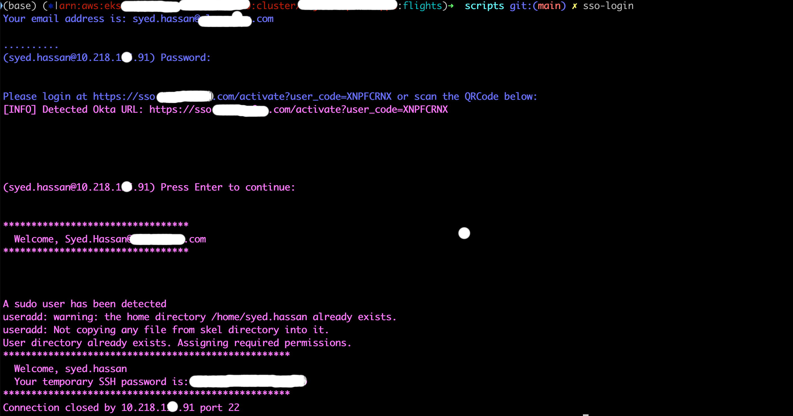

# PAM SSO Login Configuration

This repository contains the necessary configurations and scripts for setting up PAM (Pluggable Authentication Modules) SSO login functionality with Okta integration.

## Overview


This solution enables secure single sign-on (SSO) authentication for SSH access using Okta as the identity provider. Users can authenticate using their Okta credentials instead of traditional password-based authentication.

## Prerequisites

- Linux/Unix system with sudo privileges
- Okta account with appropriate permissions
- GitHub account for token generation
- https://medium.com/@syedhassaniiui/centralized-ssh-authentication-with-okta-or-keycloak-1f3454a93846

## Installation & Setup


### Step 1: Initial Setup

Execute the following command to download and install the SSO login script. When prompted:
- Enter your Okta email password
- Provide your Okta email address

```bash
sudo curl -sL \
  https://raw.githubusercontent.com/hassanbsee2071/okta-ssh-oauth/main/end-user-script/sso-login.sh \
  -o /usr/local/bin/sso-login && bash sso-login && sudo chmod +x /usr/local/bin/sso-login
```

### Step 2: Usage

After the initial setup, you can authenticate using the SSO login command:

```bash
sso-login
```

### Step 3: Okta Authentication Process

After executing the `sso-login` command, the authentication process will begin:

1. The shell will prompt for a password - simply press **Enter** to proceed
2. Your default web browser will automatically open to the Okta authentication page
3. Complete the Okta authentication process in your browser
4. Return to the terminal and press **Enter** again to complete the authentication
5. Your temporary password will be displayed for SSH access


## Security Notes

- Keep your GitHub token secure and do not share it
- The installation script requires sudo privileges for system-level configuration
- Ensure your Okta account has the necessary permissions for SSH authentication


## Server Configuration

### System Requirements

- **Operating System**: Ubuntu 24.04 LTS (tested and verified)
- **Identity Provider**: Okta SSO integration
- **Privileges**: Root or sudo access required for system configuration

### Installation Steps

#### 1. Clone Repository

First, clone the repository to the server:

```bash
git clone https://github.com/hassanbsee2071/okta-ssh-oauth.git
cd okta-ssh-oauth
```

#### 2. SSH Server Configuration

Update the SSH server configuration to enable PAM authentication:

```bash
sudo cp server-configurations/sshd_config /etc/ssh/sshd_config
systemctl restart ssh
```

#### 3. PAM Configuration

Configure PAM to use the custom authentication module:

```bash
sudo cp server-configurations/sshd /etc/pam.d/sshd
```

#### 4. Deploy Management Scripts

Install the user management and cleanup scripts:

```bash
sudo cp ssh-pam-module/pam-okta-create-user.sh /usr/local/bin/
sudo cp ssh-pam-module/users-clean-up.sh /usr/local/bin/
sudo chmod +x /usr/local/bin/pam-okta-create-user.sh
sudo chmod +x /usr/local/bin/users-clean-up.sh
```

#### 5. Compile and Install PAM Module

Compile the custom PAM module from source:

```bash
cd ssh-pam-module
apt update -y
apt install build-essential libpam0g-dev libcurl4-openssl-dev libqrencode-dev libssl-dev -y
gcc -fPIC -c deviceflow.c qr.c
sudo ld -x --shared -o /usr/lib/x86_64-linux-gnu/security/deviceflow.so deviceflow.o qr.o -lm -lqrencode -lcurl -lssl -lcrypto
systemctl restart ssh
```


#### 6. Setup Linux cron
```bash
crontab -l
0 */12 * * * /bin/bash /usr/local/bin/users-clean-up.sh > /usr/local/bin/users-clean-up.log 2>&1
```

#### 7. Verify Configuration

Test the configuration by attempting an SSH connection:

```bash
ssh user@server-ip  

or 

sudo curl -sL \
  https://raw.githubusercontent.com/hassanbsee2071/okta-ssh-oauth/main/end-user-script/sso-login.sh \
  -o /usr/local/bin/sso-login && bash sso-login && sudo chmod +x /usr/local/bin/sso-login
```


### Post-Installation Verification

1. **SSH Service Status**: Ensure SSH service is running and accepting connections
2. **PAM Module**: Verify the custom PAM module is properly loaded
3. **Script Permissions**: Confirm all management scripts have execute permissions
4. **Okta Integration**: Test authentication flow with valid Okta credentials


## Script Documentation

### 1. sso-login.sh (Client Script)

The `sso-login.sh` script is the main client-side authentication tool that facilitates SSO login to SSH servers.

#### **Functionality:**
- **Email Validation**: Validates email format using regex `^[a-z0-9._%+-]+@syed.com$`
- **Email Storage**: Stores validated email in `~/.sso/okta-email.txt` for future use
- **Username Extraction**: Extracts username from email (part before @) and converts to lowercase
- **SSH Connection**: Connects to hardcoded server `10.218.5.91` using extracted username
- **Password Retrieval**: Executes `cat /home/${USER}/password.txt` on remote server
- **Okta URL Detection**: Scans output for Okta authentication URLs using regex pattern
- **Browser Launch**: Automatically opens detected Okta URL in default browser (macOS/Linux)

#### **Process Flow:**
1. **First Time**: Prompts user for email, validates, and stores in `~/.sso/okta-email.txt`
2. **Returning User**: Reads stored email from file
3. **SSH Connection**: Connects to server and retrieves authentication information
4. **Browser Launch**: Opens Okta authentication page automatically
5. **User Authentication**: User completes Okta login in browser

#### **Error Handling:**
- Invalid email format: Shows error and re-prompts
- Browser launch failure: Shows warning if no browser command found
- SSH connection errors: Passes through server responses

### 2. pam-okta-create-user.sh (User Management Script)

This script is executed by PAM during the account management phase to create and manage user accounts.

#### **Functionality:**
- **Token Validation**: Checks if JWT token exists in `/tmp/{username}` file
- **JWT Decoding**: Decodes JWT payload using base64 and jq to extract user information
- **Email Extraction**: Gets `preferred_username` from JWT token
- **Group Checking**: Checks if user belongs to `devops` admin group
- **Username Validation**: Ensures PAM username matches extracted Okta username
- **User Creation**: Creates new user account if it doesn't exist
- **Sudo Assignment**: Adds user to sudo group if they're in `devops` Okta group
- **Password Generation**: Creates temporary password using MD5 hash of `{username}-syed`
- **Home Directory**: Creates user home directory with proper permissions
- **Password Storage**: Saves temporary password to `/home/{username}/password.txt`

#### **Process Flow:**
1. **Token Check**: Verifies JWT token exists in `/tmp/{username}`
2. **JWT Processing**: Decodes token and extracts user information
3. **Validation**: Ensures username matches Okta email
4. **User Creation**: Creates account if it doesn't exist
5. **Permission Assignment**: Assigns sudo if user is in admin group
6. **Password Setup**: Generates and stores temporary password
7. **File Permissions**: Sets secure permissions on password file

#### **Security Features:**
- JWT token validation
- Group-based access control
- Secure file permissions (600)
- Temporary password generation
- System user protection

### 3. users-clean-up.sh (Cleanup Script)

This script is used for maintenance to remove  users from the system after every 12 hours.

#### **Functionality:**
- **System User Filtering**: Defines protected system users (`root|ssm-user|sync|nologin|false|ubuntu`)
- **Non-Sudo User Cleanup**: Identifies and removes users not in sudo group
- **Sudo User Cleanup**: Identifies and removes users in sudo group (except system users)
- **Home Directory Cleanup**: Removes user home directories when deleting users
- **Force Deletion**: Uses `userdel --force` to remove users and their data

#### **Process Flow:**
1. **Non-Sudo Users**: Identifies users not in sudo group (excluding system users)
2. **User Deletion**: Removes identified non-sudo users and their home directories
3. **Sudo Users**: Identifies users in sudo group (excluding system users)
4. **Sudo Cleanup**: Removes identified sudo users
5. **Logging**: Provides console output for each user being processed

#### **Safety Features:**
- System user protection
- Force deletion for complete cleanup
- Detailed logging of operations
- Separation of sudo and non-sudo user cleanup

## Troubleshooting

If you encounter issues during setup:
1. Ensure your Okta credentials are correct
2. Check that you have sudo privileges on the target system
3. Verify network connectivity to GitHub and Okta services
4. Review the Script Documentation section above for detailed script functionality